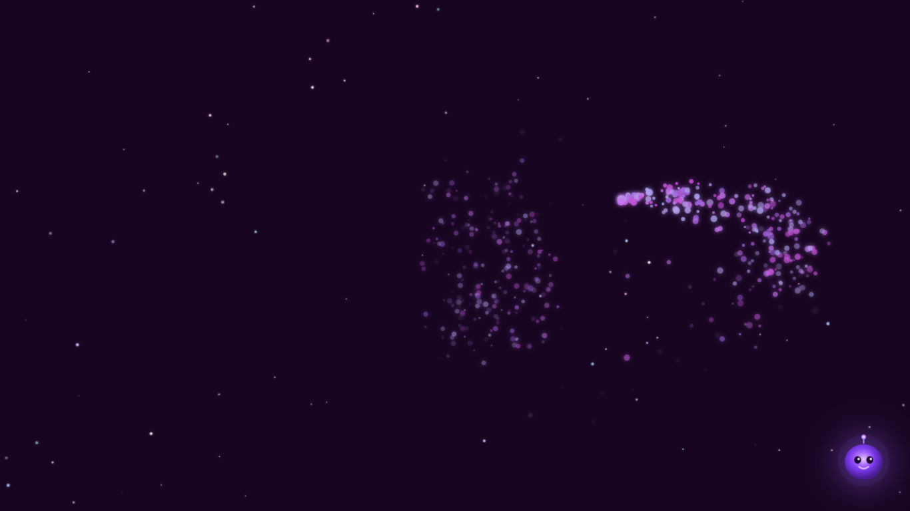
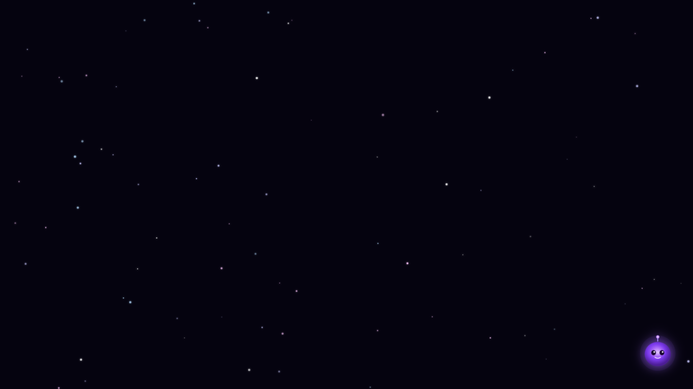

# LUMA
> **A galáxia que escuta você.**
> *Transformando tecnologia assistiva em experiência emocional.*

[](https://opensource.org/licenses/MIT)


---

## ⚠️ O Problema
Crianças com paralisia cerebral severa (níveis GMFCS IV-V), limitações motoras severas ou necessidades complexas de comunicação enfrentam barreiras físicas crônicas que as isolam do ambiente digital. Jogos e softwares tradicionais exigem **precisão milimétrica, velocidade e reflexos rápidos**. 

Quando expostas a essas ferramentas, essas crianças falham sistematicamente. Cientificamente, esse ciclo repetitivo de tentativas sem sucesso gera frustração profunda e o chamado **desamparo aprendido** — um estado clínico onde o indivíduo desiste de interagir por acreditar que não possui nenhum controle sobre o mundo ao seu redor.

## 🎯 O Objetivo
O objetivo fundamental do LUMA é romper esse ciclo de isolamento e resgatar o **senso de agência** (*"eu fiz isso acontecer"*) através do aprendizado adaptativo de causa-e-efeito. O projeto entrega uma plataforma de reabilitação e estímulo multissensorial capaz de engajar o usuário através do movimento voluntário, reduzindo estereotipias motoras e garantindo uma experiência de sucesso absoluto.

## ✨ A Solução e Funcionalidades
O LUMA desconstrói a lógica tradicional dos jogos ao aplicar a **Filosofia do Erro Zero**: o sistema elimina completamente telas de *Game Over*, pontuações, punições ou restrições de tempo. Qualquer toque, em qualquer lugar da tela, com qualquer nível de coordenação, resulta em uma vitória visual e sensorial imediata.

* **Toque Absoluto:** Resposta imediata (latência `< 100ms`) a qualquer estímulo na tela, estabelecendo conexão direta de causa-e-efeito.
* **Sistema de Partículas Fluidas:** Cada interação gera um fluxo orgânico de partículas nas cores roxo/violeta com física suave para rastreio visual voluntário.
* **Áudio Generativo Pentatônico:** Síntese sonora em tempo real baseada na escala pentatônica maior. As notas mudam harmonicamente, impedindo ruídos irritantes ou dissonantes.
* **Personagem Reativo:** A mascote central LUMA respira e reage organicamente a cada estímulo tátil.
* **Mood Engine (Universo Adaptativo):** O ecossistema monitora a frequência dos toques por segundo, adaptando as cores e a intensidade do ambiente para regular o nível de estímulo da criança.
* **Multi-touch Nativo:** Suporta múltiplos dedos ou o toque simultâneo de palmas inteiras de forma otimizada.
* **100% Offline:** Não requer conexão com a internet para funcionar, facilitando o uso em clínicas, escolas ou ambientes isolados.

---

## 🕹️ Como Funciona a Interação

1. **Estímulo Base:** Toque em qualquer ponto do Canvas para criar partículas, gerar uma nota musical e fazer a LUMA reagir.
2. **Mapeamento de Frequência:** A nota gerada varia conforme a posição horizontal ($X$) do toque — indo dos tons mais **graves à esquerda** aos mais **agudos à direita**.
3. **Transição de Estados (Moods):**
   * **Modo Animado (Roxo Vibrante):** Ativado automaticamente quando são detectados múltiplos toques consecutivos e rápidos.
   * **Modo Calmo (Azul Profundo):** Ativado se o sistema passar alguns segundos sem receber interações, diminuindo o ritmo sensorial.
4. **Política de Navegadores:** O áudio é inicializado exclusivamente após a primeira interação na tela, cumprindo os requisitos nativos de segurança de áudio web.

---

## 🛠️ Stack Técnica

O ecossistema técnico foi planejado para ser extremamente leve e performático, sustentando uma taxa de quadros estável mesmo em hardwares antigos.

| Tecnologia | Função no Projeto |
| :--- | :--- |
| **React 18 + Vite 5** | Arquitetura de interface de usuário e empacotamento rápido. |
| **HTML5 Canvas 2D** | Renderização em baixo nível do sistema de partículas e do fundo dinâmico a **60 FPS**. |
| **Web Audio API** | Síntese de ondas senoidais procedurais em tempo real (sem uso de arquivos de áudio externos). |

---

## 🚀 Como Rodar

### Pré-requisitos
* Node.js v18 ou superior instalado.

```bash
# 1. Entre na pasta do projeto
cd luma

# 2. Instale as dependências
npm install

# 3. Inicie o servidor de desenvolvimento
npm run dev
```

Abra `http://localhost:5173` no seu navegador. Para testar em um tablet ou celular conectado à mesma rede Wi-Fi, acesse o endereço IP informado sob a tag Network no seu terminal (ex: `http://192.168.x.x:5173`).

### Build para Produção

```bash
# Gerar build otimizada
npm run build

# Pré-visualizar a build localmente
npm run preview
```

---

## 📂 Estrutura do Projeto

```
luma/
├── index.html
├── package.json
├── vite.config.js
└── src/
    ├── App.jsx                  # Raiz e injeção de dependências
    ├── main.jsx                 # Ponto de entrada (Entry point)
    ├── components/
    │   ├── Canvas.jsx           # Loop de animação e eventos de toque
    │   └── LumaCharacter.jsx    # Personagem SVG animado
    ├── hooks/
    │   └── useTouchEvents.js    # Multi-touch e mouse otimizados
    ├── styles/
    │   └── global.css           # Reset CSS e layout fullscreen
    └── systems/
        ├── AudioSystem.js       # Síntese sonora pentatônica
        ├── MoodEngine.js        # Gerenciamento do estado emocional do universo
        ├── ParticleSystem.js    # Física e ciclo de vida de partículas
        └── StarField.js         # Campo de estrelas dinâmico
```

---

## 🔬 Fundamentação Clínica

As mecânicas aplicadas no LUMA estão fundamentadas em dados e ensaios clínicos publicados em literatura médica revisada por pares:

| Princípio Clínico | Impacto Documentado | Referência Científica |
| :--- | :--- | :--- |
| Aprendizado de Causa-e-Efeito | Reduz de forma expressiva o tempo de reação e amplia o engajamento ativo de crianças em níveis severos de PC. | Frontiers in Rehabilitation Sciences, 2024 (PMC12384173) |
| Estímulo Multissensorial (MSE) | Diminui estereotipias motoras frequentes (hand flapping) e atenua comportamentos de autoagressão. | Research Open Access, 2022 (PMC9678634) |
| Gamificação Sem Falhas | Gera maior conformidade e adesão ao tratamento, melhorando em até 60% (SMD 0.60) a função motora grossa. | JMIR Serious Games, 2022 |

---

## 📊 Métricas para Pesquisa Clínica

Para fins de validação acadêmica ou acompanhamento terapêutico individualizado, o sistema viabiliza a extração de dados focados em:

* **Métricas Motoras:** Tempo de reação (latência em ms); contagem de toques voluntários independentes por minuto.
* **Métricas Comportamentais:** Duração total da atenção sustentada no foco visual; redução quantitativa de episódios de autoagressão ao longo das sessões.

---

## 🗺️ Roadmap

| Fase | Descrição | Status |
| :--- | :--- | :--- |
| Fase 1 | MVP — Canvas 2D, partículas, Web Audio pentatônico e Mood Engine. | ✅ Concluído |
| Fase 2 | Painel do Terapeuta — Integração com Firebase, histórico de sessões e métricas clínicas. | 🔜 Próximo |
| Fase 3 | IA Adaptativa — Uso de TensorFlow.js para aprendizado on-device de padrões motores. | 📅 Planejado |
| Fase 4 | APK Android Nativo — Build nativa para tablets via Capacitor + Android Studio. | 📅 Planejado |
| Fase 5 | Multiplayer Emocional — Sessões cooperativas e colaborativas remotas via WebRTC. | 📅 Planejado |

---

## 📄 Licença

Distribuído sob a Licença MIT. Veja o arquivo LICENSE para mais informações.

---

## 👥 Desenvolvedores

**Gustavo Alves**  
**Vinicius Castro**
